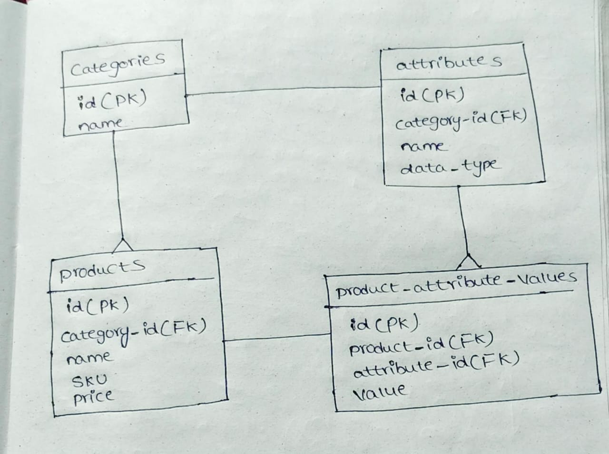
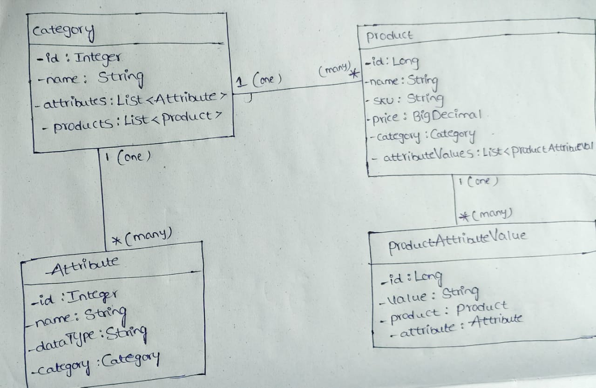

 Internal Product Management Tool for eCommerce

This project is a backend application designed to manage an eCommerce product catalog. It provides a RESTful API for a scalable solution that allows for defining dynamic product categories, managing custom attributes for each category, and handling product creation and updates.

 1. Database Design

The database is designed using an Entity-Attribute-Value (EAV) model to ensure maximum flexibility and scalability. This allows the business to introduce new product categories with completely unique sets of attributes in the future without requiring any changes to the database schema.

 Entity-Relationship Diagram (ERD)


-->Design Justification 
   Scalability: New categories and attributes can be added by simply inserting new rows into the categories , attributes and  tables. No database migrations (ALTER TABLE) are needed, which is critical for a rapidly growing eCommerce platform. 
  -->Flexibility: Each product category can have its own unique set of attributes (e.g., "RAM" for Smartphones, "Strap Type" for Watches), and this is handled without adding new columns to the products table. 
 -->Normalization: The schema is normalized to reduce data redundancy. For instance, attribute names like "OS" or "Color" are stored only once in the attributes table and reused across many products. 

 2. Class Design

The Java class structure mirrors the database design, using JPA entities to map tables to objects. The design uses a layered architecture (Controller, Service, Repository) to ensure a clean separation of concerns, making the code maintainable and easy to test.

-->Class Diagram 


3. Technology Stack
-->Language: Java 8 
-->Framework: Spring Boot 
-->Data Persistence: Spring Data JPA 
-->Database: MySQL 
-->Build Tool: Apache Maven 

 4. How to Run the Project

Follow these steps to get the application running locally.

 Prerequisites
*   JDK 8 or higher
*   Apache Maven
*   MySQL Server

--> Steps 
1.  Clone the Repository 
      Replace the placeholder link below with your actual repository URL. 
    ```sh
    git clone https://github.com/your-username/your-repository-name.git
    cd your-repository-name
    ```

2.  Set Up the Database
    *   Ensure your MySQL server is running.
    *   Create a new database named "product_catalog_db". 
    *   Execute the SQL script located at "/database/schema.sql" to create the tables and insert the initial sample data. 

3.  Configure the Application 
    *   Open the "src/main/resources/application.properties" file. 
    *   Update the "spring.datasource.username" and "spring.datasource.password" properties with your personal MySQL credentials. 

4.  Run the Application 
    *   You can run the application from your IDE by running the "main" method in "ProductCatalogApplication.java". 
      Alternatively, you can run it from the command line using Maven: 
    ```sh
    mvn spring-boot:run
    ```
    The application will start successfully on `http://localhost:8080`.

 5. How to Use the API (Postman Examples) 

You can use an API client like Postman to interact with the running application and test its functionality.

 A. Get All Categories 
This endpoint fetches a list of all product categories and their defined attributes. It's a good first test to see if the application is connected to the database.
-->Method: "GET" 
-->URL: "http://localhost:8080/api/categories" 

B. Create a New Product 
This endpoint creates a new product within a specific category and provides values for its custom attributes. This demonstrates the core functionality of the EAV model.
-->Method: "POST" 
-->URL:"http://localhost:8080/api/products" 
-->Body: "raw" (JSON) 

-->Example JSON Payload: 
(This example assumes the "Smartphones" category (ID=1) and its attributes (IDs=1,2,3) were created by the initial SQL script).
json 
{
    "name": "Pixel Pro 10",
    "sku": "SKU-PP10-128",
    "description": "The latest smartphone with an amazing AI camera.",
    "price": 999.00,
    "category": {
        "id": 1
    },
    "attributeValues": [
        {
            "attribute": {
                "id": 1
            },
            "value": "Android 16"
        },
        {
            "attribute": {
                "id": 2
            },
            "value": "16GB"
        },
        {
            "attribute": {
                "id": 3
            },
            "value": "5500mAh"
        }
    ]
}